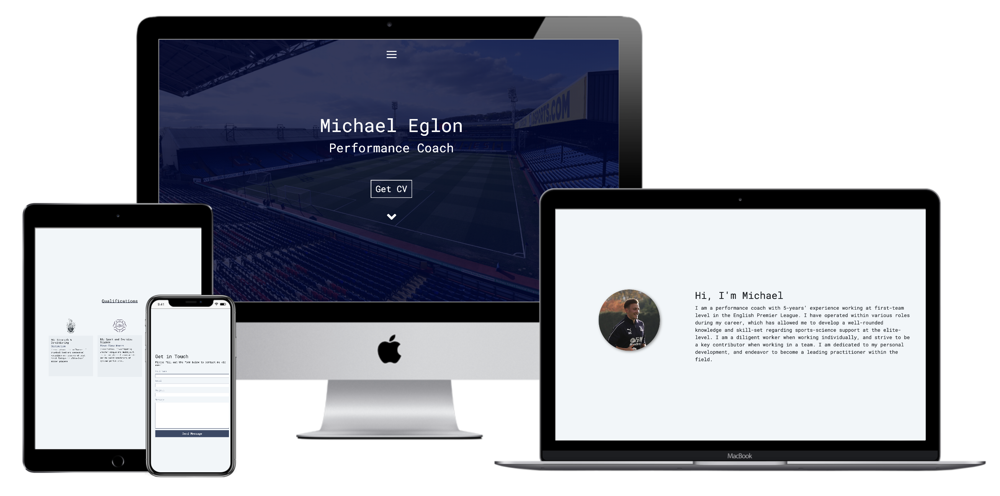
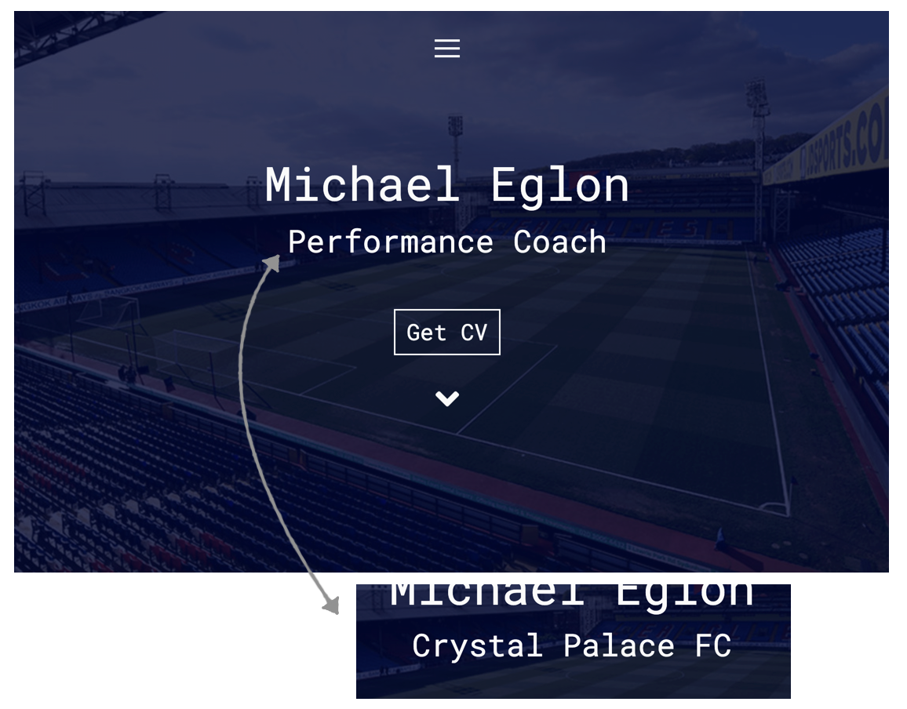
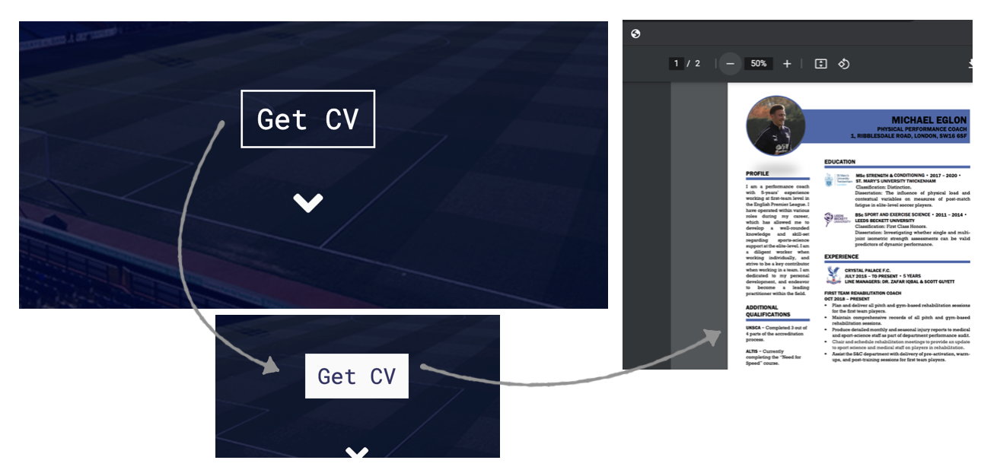
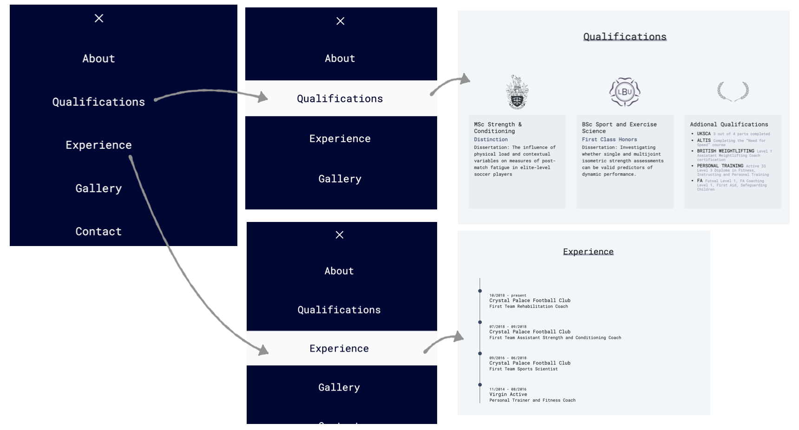
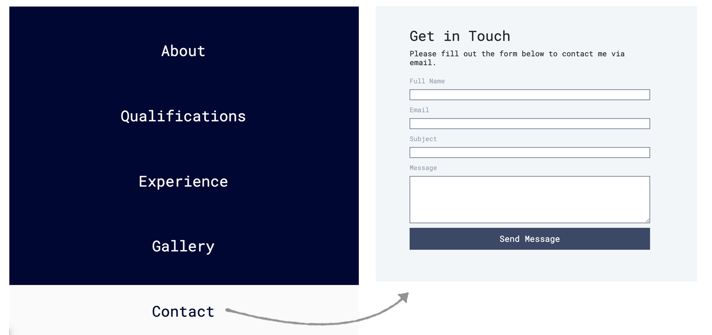

<div align="center">
<hr>

**A custom site built for a client to present their current qualifications and experience to potential employers.**

This app was built using [VScode](https://code.visualstudio.com/) and deployed to [GitHub](https://pages.github.com/).

[View site](https://lucyjpjones.github.io/mjbe-resume/)

</div>

---

## <u>Table of contents</u>

**<details><summary> User Experience (UX)</summary>**
  - [Purpose](#purpose)
  - [Design](#design)
  - [User stories](#user-stories)
</details>

**<details><summary> Features</summary>**
  - [Features used](#features-used)
  - [To do list](#to-do-list)
  - [Status](#status)
</details>

**<details><summary> Technologies</summary>**
  - [Languages](#languages)
  - [Frameworks, Libraries & Programs](#frameworks-libraries-programs)
</details>

**<details><summary> Deployment</summary>**
  - [Deploy to Heroku](#deploy-to-github)
  - [Accessing code](#accessing-code)
</details>

**<details><summary> Testing</summary>**
  - [Testing user stories](#testing-user-stories)
  - [Validator checks](#validator-checks)
  - [Responsive Design](#responsive-design)
  - [Additional Testing](#additional-testing)
  - [Bugs](#bugs)
</details>

**<details><summary> Credits</summary>**
  - [Content](#content)
  - [Media](#media)
  - [Acknowledgements](#acknowledgements)
</details>

**<details><summary> Contact</summary>**
  - [Contact details](#contact-details) 
</details>
---

# &rarr; **User Experience (UX)**

### **Purpose**

This online resume was built for a client to present their current qualifications and experience to future employers.
### **Design**

**Structure**

- A simple single page design structure with a header navbar and full screen view navigation menu to access each page section. 

**Colour scheme**
- A simple colour scheme to keep the design looking clean and elegant.
- A pale background used throughout the site to avoid any visual obstacles and helping add visual emphasis to other important parts of the design. It is also easier on the eye than a classic white.

**Typography**
- 'Roboto Mono' has been used as the main font throughout the website with Monospace as the fallback font if for any reason the font isn't being imported into the site correctly. It is a classic typewriter typeface used frequently in programming, so it is both attractive and appropriate.

### **User stories**

The <u>key priorities</u> for my user are as follows:

1. To be able to easily navigate throughout the site to find the desired content

2. Ability to access a hard copy of CV

3. Present Qualifications and Experience

4. Ability to easily get in contact by email

5. Access links to external social accounts

---
## &rarr; **Features**

### **Features used**

- **Responsive on all device sizes**
  - Responsive on all devices through using React Bootstrap and CSS media queries.

- **A user-friendly interface with easy navigation throughout the site**
  - Attractive, minimalistic design with visuals and information presented clearly and concisely.

  - Easily readable fonts and simple navigation throughout the site.
    - Fixed navigation bar

  - An aesthetically pleasing 404 page if the user is directed to a non-existent page.

- **Buttons**
    - Stand out interactive button to download CV

- **Form**
  - An EmailJS contact form with submit button for users to easily get in touch via my website.
  - The form has been set up to ensure all fields are filled out and that the email is written in the correct format

- **Timeline**
  - Experience presented in a timeline to providing a clear summary

- **Card Listings**
  - Used to display my Qualifications
  - Image included contributing to the visual look

- **External links to social platforms**
  - Recognisable icons with links to my external social platforms.

---

## &rarr; **Technologies**

### **Languages**

- [HTML5](https://en.wikipedia.org/wiki/HTML5)
- [CSS3](https://en.wikipedia.org/wiki/Cascading_Style_Sheets)
- [JavaScript](https://www.javascript.com/)

### **Frameworks, Libraries & Programs**

- [**React**](https://reactjs.org/)
  - An open-source JavaScript library used for building the user interface.

- [**React MDBootstrap**](https://mdbootstrap.com/docs/react/)
  - Used to assist with the responsiveness and styling of the website using design components.

- [**AOS**](https://michalsnik.github.io/aos/)
    - Used for page scroll animations.

- [**Google fonts**](https://fonts.google.com/)
  - Google fonts were used to import the fonts into the CSS file which is used on all pages throughout the project.

- [**Font Awesome 4.7.0**](https://fontawesome.com/)
  - Font Awesome was used to add icons for aesthetic and UX purposes.

- [**VScode**](https://code.visualstudio.com/)
  -  Code editor used for building web application.

- [**GitHub**](https://github.com/)

  - GitHub is the hosting platform used to store the project code.

- [**HTML Formatter**](https://www.freeformatter.com/html-formatter.html) and [**CSS Formatter**](https://www.freeformatter.com/css-beautifier.html)

  - Used to format my HTML and CSS file with the desired indentation level for optimal readability.
    
---

## &rarr; **Deployment**

---
## &rarr; **Testing**

### **Testing user stories**

 Testing my user's <u>key priorities</u>:

1. **To be able to easily navigate throughout the site to find the desired content**
- Upon entering the site, users are automatically greeted with a simple structured homepage 
-  The header features a hamburger menu icon which triggers a full page naviagtion menu.

    

2. **Ability to access a hard copy of CV**
- 'CV' link on the homepage which is a direct link to download a hard copy of my CV.
- Opens up my CV in a new tab in the browser so the user won't lose their place on the site.

    

3. **Present Qualifications and Experience**
- 'Qualifications' and 'Experience' link on menu for quick navigation
- Cards used to display Qualifications including image, title and details
- Experience presented as a timeline with summary of each position with date and company 

    

4. **Ability to easily get in contact by email**
- 'Contact' link on the menu bar to navigate directly to contact form
- '@' symbol in footer which directly navigates user to an email service to send an email with added custom subject

    

5. **Access links to external social accounts**
- Social platform icons are displayed on footer linking to the appropriate sites

    


### **Validator checks**

### **Responsive Design**

- Media queries used in the CSS file to target larger devices.

### **Additional Testing**

### **Bugs**

| | Bug                                                  | Action                                           |
|-----------|------------------------------------------------------|--------------------------------------------------|
| [X]       | Carousel not displaying correctly on window resize unless window is refreshed | Added setEffect code for WindowWidth resize to ensure carousel updated correctly each time a window changes, code used found [here](https://gist.github.com/gaearon/cb5add26336003ed8c0004c4ba820eae#file-usewindowwidth-js)  |
| [ ]       | 2 | 22 |
| [ ]       | 3 | 33 |

---
## &rarr; **Credits**

### **Content**
 - Code help for linking href to email account [here](https://css-tricks.com/snippets/html/mailto-links/)

- Code help for scroll snapping [here](https://css-tricks.com/practical-css-scroll-snapping/)
### **Media**
- All written content was taken from my the hard copy of my clients resume

- Images gallery photos were provided by client

- Homepage image from [here](https://www.arsenal.com/tickets/arsenal/2017-Dec-28/crystal-palace)

- Qualifications Images 
  - [Leeds Beckett logo](https://twitter.com/leedsbeckett)
  - [Queen Mary logo](https://www.linkedin.com/school/st-mary%27s-university-twickenham/)
  - [Acheivements logo](https://webstockreview.net/image/laurel-clipart-feather/1515610.html)

### **Acknowledgments**

---

## &rarr; **Contact**

### **Contact details**

Created by @lucyjpjones

If you have any problems, questions or, suggestions for my project please contact me on the email below:

```
lucyjpjones@gmail.com
```

Thanks for visiting.

&copy;
LucyJPJones